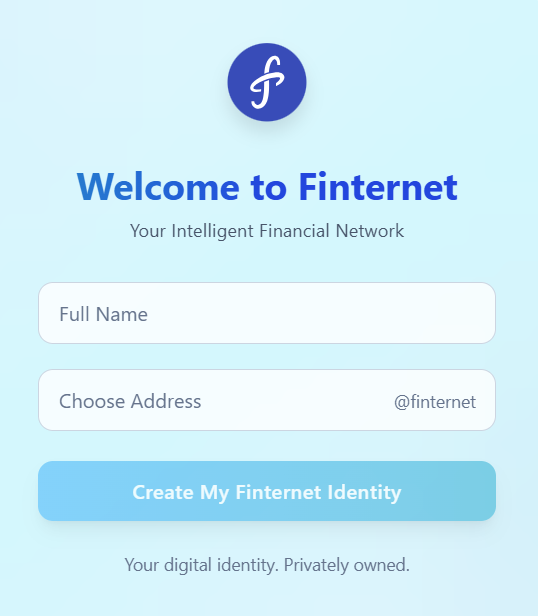
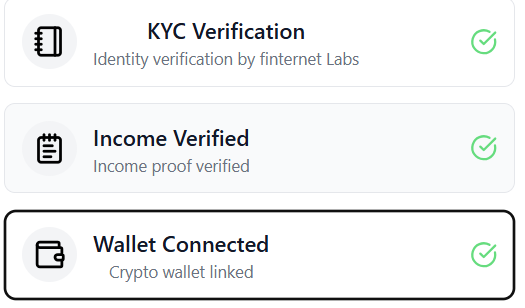

 ```bash
cd FinternetLab_Assginment
 ```

<br>
 **1] First Install Dependencies**
 ```bash
 npm run install
```
**2] Start the Development Server**
```bash
npm run dev
```


or
<br>
**2]-1 Build for Production**
```bash
npm run build
```

<br>
**2]-2 To preview the production build locally:**
```bash
npm run preview
```

---

<br>
credential example:<br>
full name: Vishv Moradita<br>
Choose Adress : vishmor

---

for now
In the dashboard, the user can verify their documents by pressing the verification button.


after:<br>



---

in cross border trasition

credential data will be like:
Example: gloary@finternet
 