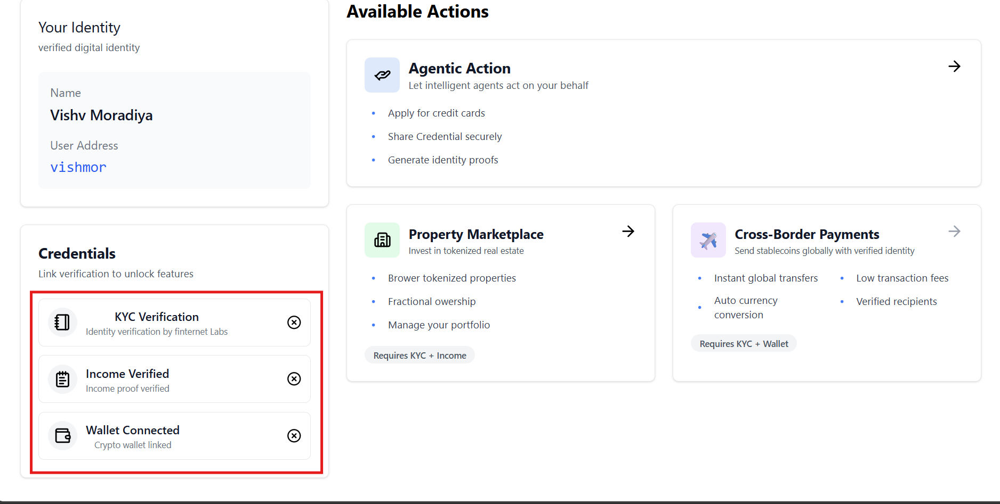

 **1] First Install Dependencies**
 `npm run install`

**2] Start the Development Server**
`npm run dev`

or
**2]-1 Build for Production**
`npm run build`

**2]-2 To preview the production build locally:**
`npm run preview`

---

credential example:
full name: Vishv Moradita
Choose Adress : vishmor

---

in dashboard , user we verify document 
but now for verification but press button in dashboard 

after:

---

in cross border trasition

credential data will be like:
Example: gloary@finternet
 